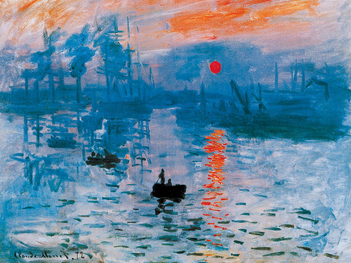

# 모네
<html>

이 그림은 모네의 인상, 해돋이입니다. 이 그림에서 인상주의가 시작되었습니다.
그는 대상을 바라보기 위해서는 바라보는 대상의 이름을 잊어야 한다고 말했습니다.
오직 대상과 빛에 집중할 때 진정한 바라봄이 가능하다는 것이죠.
그에 대해 더 알아보고 싶다면 아래 그림을 클릭해 주세요.

  

<a href="https://namu.wiki/w/%ED%81%B4%EB%A1%9C%EB%93%9C%20%EB%AA%A8%EB%84%A4">

